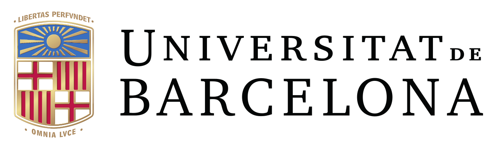

# Bioinformatics UB - Sesión Exposoma
## Introduction to the concept of the Exposome and its methodologies.
  

- Alan Domínguez, Predoctoral Researcher at the Barcelona Institute for Global Health (ISGlobal)
- Augusto Anguita-Ruiz, Junior Researcher Leader at the Barcelona Institute for Global Health (ISGlobal)

In this repository you will find the different practical sessions and hands-on tutorials that are teached in the subject of Bioinformatics in the Master of Biomedicine of Universitat de Barcelona.

If you have any question, please, do not hesitate in contacting us (augusto.anguita@isglobal.org).
